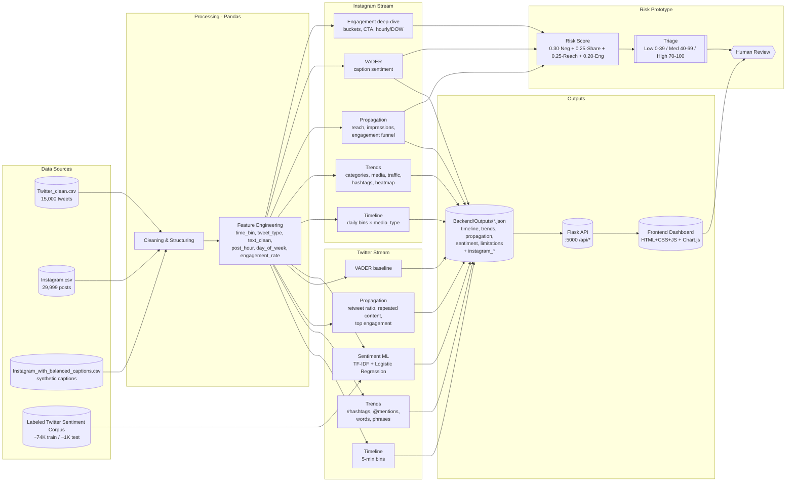

# Social Media Intelligence (SMI) — Full Project Documentation

### SIH Prototype | IMSEC | August 2026

> **AI-Based Social Media Analytics and Threat Risk Assessment**
> Trend Analysis · Sentiment Analysis · Engagement Analytics · Risk Prioritization

---

| Field             | Value                                                                        |
| :---------------- | :--------------------------------------------------------------------------- |
| **Project**       | Social Media Intelligence (SMI) — AI-Based Social Media Analytics Prototype  |
| **Track**         | Smart India Hackathon (SIH) 2026 Internal Round                              |
| **Institution**   | IMSEC                                                                        |
| **Status**        | Prototype Framework Complete                                                 |
| **Version**       | `v0.1-prototype` — August 2026                                               |
| **Stack**         | Python / Pandas / scikit-learn / Flask / VADER / Chart.js / Vanilla JS       |
| **Repository**    | Deployed on Render & a repository on Github                                  |
| **Documentation** | `DOCUMENTATION.md` (this file) — derived from 3 source PDFs + codebase audit |

**Source PDFs ingested:**

1. `AI-Based Social Media Analytics and Threat Risk Assessment.docx.pdf` — 8-page final technical report
2. `SIH_Social_Media_Analytics_Consolidated_Meetings.pdf` — 3-page consolidated meetings 1–4 (27–30 Aug 2026)
3. `Social_Media_Analytics_Final_Report.pdf` — 19-page final report including all meeting notes + risk prototype

> **Interpretation notice (carried from all source docs):** The risk score in this prototype is a **heuristic prioritization signal, not a confirmed threat probability**. A negative post is not automatically a threat; multiple signals plus human review are required.

---

## Table of Contents

1. [Executive Summary](#1-executive-summary)
2. [Problem Statement & SIH Context](#2-problem-statement--sih-context)
3. [Project Vision & Prototype Strategy](#3-project-vision--prototype-strategy)
4. [System Architecture](#4-system-architecture)
5. [Technology Stack](#5-technology-stack)
6. [Repository Structure](#6-repository-structure)
7. [Datasets & Data Preparation](#7-datasets--data-preparation)
8. [Analytical Pillars](#8-analytical-pillars)
9. [Machine Learning — Sentiment Classification](#9-machine-learning--sentiment-classification)
10. [Risk Prioritization Prototype](#10-risk-prioritization-prototype)
11. [Backend — Flask API](#11-backend--flask-api)
12. [Frontend — Dashboard & Design System](#12-frontend--dashboard--design-system)
13. [Key Findings & Results](#13-key-findings--results)
14. [Meeting Records (27–30 Aug 2026)](#14-meeting-records-2730-aug-2026)
15. [Team](#15-team)
16. [Getting Started](#16-getting-started)
17. [Usage Guide](#17-usage-guide)
18. [Limitations & Data Gaps](#18-limitations--data-gaps)
19. [Future Roadmap](#19-future-roadmap)
20. [Ethics, Safety & Human-in-the-Loop](#20-ethics-safety--human-in-the-loop)
21. [References & Source Artifacts](#21-references--source-artifacts)
22. [Appendix](#22-appendix)

---

## 1. Executive Summary

SMI is a **lean, verifiable prototype** of an AI-driven social-media analytics engine that converts unstructured social data into actionable intelligence. It deliberately avoids building the full multi-platform, streaming SIH architecture in the internal round, and instead proves the core concept end-to-end on two curated corpora:

* **Twitter (Avengers: Endgame corpus)** — 15,000 tweets in an 81-minute window (2019-04-23 09:20–10:40) for **timeline, propagation, trends, and supervised sentiment**.
* **Instagram (content-performance corpus)** — 29,999 posts across 23 signals and a 366-day window for **timing, category, media-type, reach/impressions, engagement, and VADER-based sentiment** over synthetic captions.

The pipeline is intentionally lightweight:

```
Existing CSV datasets → Pandas cleaning/structuring → Distinct platform streams
   → Timeline · Trends · Propagation · Sentiment · Engagement → JSON outputs → Flask API → Vanilla-JS dashboard (Chart.js)
```

A second-layer **risk-prioritization prototype** combines four normalized signals into a triage score (`0–100`) to rank posts for analyst review — explicitly **not** a threat classifier.

**Headline outcomes:**

| Area | Result |
| :--- | :--- |
| Instagram dataset | 29,999 posts · 23 columns · 0 missing values (checked) · 366-day span |
| Twitter conversation | ~90% retweets (13,501 / 15,000) — strongly amplification-driven |
| VADER baseline (all tweets) | Positive 52.94% / Neutral 38.42% / Negative 8.64% |
| VADER (originals only) | Neutral 46.56% / Positive 38.96% / Negative 14.48% |
| ML sentiment model | **TF-IDF + Logistic Regression — 98.74% accuracy** on 398 genuinely unseen tweets (5 errors) |
| ML inference distribution | Neutral 60.81% / Positive 31.0% / Negative 8.19% (model-predicted) |
| Instagram VADER (29,999) | Positive 46.01% / Negative 28.49% / Neutral 25.49% |
| Risk prototype | `Risk = (0.30·Neg + 0.25·Share + 0.25·Reach + 0.20·Eng) × 100` → Low 0–39 / Medium 40–69 / High 70–100 |

---

## 2. Problem Statement & SIH Context

The SIH problem statement asks for an **AI-driven social-media analytics framework** that ingests raw social data and returns meaningful, audience-level intelligence. The team frames it as four core analytical questions plus one supporting capability:

| Question | Analysis Area | Purpose |
| :--- | :--- | :--- |
| What are people saying? | **Trend / Topic Detection** | Topics, hashtags, terms, rising narratives |
| How are people feeling? | **Sentiment & Emotion Analysis** | Positive / Negative / Neutral + drift over time |
| Who is the audience? | **Demographic Profiling** | Audience characteristics (deferred in prototype) |
| How does information spread? | **Network / Link Analysis** | Interactions, propagation, amplification |
| *(supporting)* | **Continuous Collection & Timeline Management** | Chronological preservation, temporal dynamics |

For a full deployment this would span multiple platforms feeding a unified, streaming pipeline with NLP, graph, and supervised-threat models. The SIH prototype scopes down to **proving the concept is sound**.

---

## 3. Project Vision & Prototype Strategy

### 3.1 Full Vision vs. Internal-Round Goal

| The tempting goal | The right goal (internal round) |
| :--- | :--- |
| Build the complete SIH solution on day one | Build a **small, working demonstration that proves the core concept** |

Rationale: limited development time. Depth over breadth — implement a smaller set of capabilities **properly**, with clean data, verified metrics, and explainable outputs.

### 3.2 Overall Concept

```
Collect social-media data → Organise chronologically → Analyse (content / sentiment / audience / interactions) → Present actionable insights
```

### 3.3 Internal-Round Prototype Scope (what this repo actually demonstrates)

* Twitter sentiment classification + sentiment-over-time
* Twitter trend / timeline + basic interaction analysis (`screenName → replyToSN` graph skeleton)
* Instagram content-performance + engagement + reach + timing analysis
* Simple visual dashboard (dark + purple design system) served locally by Flask
* **Out-of-scope for this round:** live API ingestion, streaming infra, custom demographic profiling, full graph propagation, authenticated threat labels

---

## 4. System Architecture

### 4.1 High-Level Architecture



### 4.2 Processing Flow (as documented in PDFs)

1. Load existing CSV datasets (no live API at prototype stage)
2. Clean and structure with Pandas; normalize timestamps
3. Preserve `created`/`post_datetime` for temporal analysis
4. Process Twitter stream: sentiment, trends, network skeleton
5. Process Instagram stream: content, timing, engagement, reach
6. Combine outputs into JSON + visual dashboard
7. Present insights that demonstrate the audience-intelligence concept
8. Route high-signal posts to risk triage → analyst review

### 4.3 Data → Insight Layers

| Layer | Twitter | Instagram |
| :--- | :--- | :--- |
| **Temporal** | 5-minute `time_bin` | 1-day `post_date` bin + hourly heatmap |
| **Content** | hashtags, mentions, words, bigrams | categories, media_type, traffic_source |
| **Engagement** | retweet_count, favorite_count, engagement = RT+fav | likes, comments, shares, saves, reach, impressions |
| **Sentiment** | VADER baseline + TF-IDF/LR model | VADER on synthetic captions |
| **Propagation** | retweet ratio, repeated text, top amplified | reach funnel, top posts/accounts, media breakdown |
| **Risk** | (future: shares + sentiment) | weighted heuristic across Neg/Share/Reach/Eng |

---

## 5. Technology Stack

| Layer | Technology | Role |
| :--- | :--- | :--- |
| **Language** | Python 3.14 | Analytics + backend |
| **Data** | Pandas, NumPy | Cleaning, grouping, time-binning |
| **NLP (Lexicon)** | `vaderSentiment` | Baseline sentiment (VADER compound ≥+0.05 Pos / ≤−0.05 Neg) |
| **NLP (ML)** | `scikit-learn` — `TfidfVectorizer` (1–2 grams, sublinear_tf) + `LogisticRegression` (C=10, max_iter=1000) | Supervised sentiment classifier |
| **ML persistence** | `joblib` | `Backend/models/sentiment_model.joblib` bundle `{vectorizer, model, classes}` |
| **Backend** | Flask 3.x | Serves JSON + static `Frontend/` on port 5000 |
| **Frontend** | Vanilla HTML + CSS + JS (no framework) | Prototype dashboard |
| **Charts** | Chart.js (CDN) | Donuts, bars, stacked timelines, multi-line trend series |
| **Styling** | Custom design tokens + `Inter`/`Geist` | Dark + purple system (see §12) |
| **Analysis notebooks** | Jupyter (`ML/Source/Instagram/*.ipynb`, `ML/Source/Notebooks/*.ipynb`) | EDA source for reports |
| **Tooling** | Git, VS Code, venv | Development |

**Design-language constraint:** No heavy frameworks, no build step — keeps the prototype "analytics separate from app" and easy to run for SIH evaluators.

---

## 6. Repository Structure

```
Social Media Intelligence (SMI)/
├── Backend/
│   ├── app.py                      # Flask server — JSON API + static frontend
│   ├── analytics.py                # Twitter pillar: timeline/trends/propagation/sentiment → JSON
│   ├── instagram_analytics.py      # Instagram pillar: 5 engines → instagram_*.json
│   ├── train_sentiment.py          # Wrapper — calls ML/Source/Twitter/Sentiment_analysis.py
│   ├── API_CONTRACT.md             # Endpoint spec (input for BUILD_PROMPT)
│   ├── models/
│   │   └── sentiment_model.joblib  # Persisted TF-IDF+LR bundle
│   └── Outputs/                    # Generated JSON (git-ignored in some setups)
│       ├── timeline.json           # Twitter: volume + original/retweet per 5-min bin
│       ├── trends.json             # hashtags, mentions, words, phrases, trends_over_time
│       ├── propagation.json        # ratio, top tweets, repeated content, timeline, summary
│       ├── sentiment.json          # distribution, over_time, trend, activity, note
│       ├── limitations.json        # Disclaimers for every Twitter detail page
│       ├── instagram_timeline.json
│       ├── instagram_trends.json
│       ├── instagram_propagation.json
│       ├── instagram_sentiment.json
│       ├── instagram_engagement.json
│       └── instagram_limitations.json
├── Frontend/
│   ├── index.html                  # Landing — wordmark + platform chooser (Instagram/Twitter)
│   ├── about.html                  # Team network (interactive) + 6 profile cards
│   ├── twitter.html                # Twitter hub — 4 pillars grid
│   ├── instagram.html              # Instagram hub — 5 pillars grid
│   ├── propagation.html            # Twitter detail: ratio donut, timeline stacked, tables
│   ├── sentiment.html              # Twitter detail: distribution + over_time + trend
│   ├── timeline.html               # Twitter detail: volume + top intervals
│   ├── trend.html                  # Twitter detail: hashtags/mentions/words/phrases
│   ├── instagram_propagation.html  # Instagram detail: reach, funnel, media breakdown
│   ├── instagram_sentiment.html    # Instagram detail: VADER distribution + engagement cross
│   ├── instagram_timeline.html     # Instagram detail: daily posting + peak
│   ├── instagram_trend.html        # Instagram detail: categories, traffic, heatmap
│   ├── instagram_engagement.html   # Instagram detail: buckets, CTA, heatmap
│   ├── assets/
│   │   ├── styles.css              # Shared theme (tokens, utilities, motion)
│   │   └── app.js                  # Shared fetch/theme/chart helpers
│   ├── images/                     # Team photos: arib.jpg, Kunal.jpeg, Mansi.jpeg, ...
│   └── BUILD_PROMPT.md             # Design brief + API contract for frontend builders
├── ML/
│   └── Source/
│       ├── Twitter/
│       │   └── Sentiment_analysis.py   # Single source of truth for vectorizer + model
│       ├── Instagram/
│       │   ├── sentiment_analysis.ipynb
│       │   └── time_and_trend_analysis.ipynb
│       └── Notebooks/
│           └── Twitter_analysis.ipynb
├── Data/
│   ├── Raw/                        # Original dumps (Twitter.csv, Instagram.csv, ...)
│   ├── Processed/                  # Curated inputs for analytics.py
│   │   ├── Twitter_clean.csv       # 15,000 — avengers corpus ready for binning
│   │   ├── Instagram.csv           # 29,999
│   │   ├── Instagram_with_balanced_captions.csv  # 29,999 + synthetic captions for VADER
│   │   ├── Twitter Training Dataset Cleaned.csv  # 57,178 usable after clean (from ~74K)
│   │   └── Twitter Testing Dataset Cleaned.csv   # 398 genuinely unseen rows after dedupe
│   └── Reports/                    # Dataset reports + Statistics Sheet.xlsx
├── Documentation/                  # Source PDFs (3 files — see header)
├── .gitignore
├── .venv/                          # Local virtualenv (not committed)
├── DOCUMENTATION.md                # ← This file
└── README.md                       # Short GitHub-facing readme
```

---

## 7. Datasets & Data Preparation

### 7.1 Instagram Dataset

| Attribute | Value |
| :--- | :--- |
| **Rows** | **29,999** post records |
| **Columns / signals** | **23** (13 numeric + 9 text/category + 1 target candidate) |
| **Missing values** | **0** (checked snapshot — structurally complete) |
| **Observed date span** | **366 days** (`post_date` — sampled window, not live stream) |
| **File** | `Data/Processed/Instagram.csv` + caption-augmented `Instagram_with_balanced_captions.csv` |

**Column groups:**

| Group | Fields |
| :--- | :--- |
| **Account** | `post_id`, `account_id`, `account_type` |
| **Audience** | `follower_count` |
| **Content** | `media_type` (image/carousel/reel), `content_category`, `caption`, `caption_length`, `hashtags_count` |
| **Traffic** | `traffic_source`, `has_call_to_action` |
| **Time** | `post_datetime`, `post_date`, `post_hour`, `day_of_week` |
| **Engagement** | `likes`, `comments`, `shares`, `saves` |
| **Exposure** | `reach`, `impressions` |
| **Growth** | `followers_gained` |
| **Outcome** | `engagement_rate`, `performance_bucket_label` |

**Derived analytics:**

* `engagement_rate = [(likes + comments + shares + saves) / followers] × 100`
* Intent-segmented: **Likes → Attention**, **Comments → Conversation**, **Shares → Propagation**, **Saves → Perceived long-term value**, **Reach → Unique exposure**, **Impressions → Total exposure**

**Caption context:** Raw caption text is **not present** in `Instagram.csv`; direct NLP is therefore demonstrated on `Instagram_with_balanced_captions.csv` (synthetic captions generated for engagement simulation). Instagram sentiment is a **polarity proxy, not ground truth**.

### 7.2 Twitter Dataset (Avengers: Endgame)

| Attribute | Value |
| :--- | :--- |
| **Rows analyzed** | **15,000** tweets (`Data/Processed/Twitter_clean.csv`) |
| **Original columns** | 17 (raw) → 14 retained after cleaning |
| **Time window** | **81 minutes** — `2019-04-23 09:20` → `10:40` — binned in **5-minute** intervals |
| **Tweet typing** | `is_retweet` standardized → `tweet_type` = `Original` or `Retweet` |
| **Sentiment training corpus** | ~74K tweets raw → **57,178 usable** after cleaning |
| **Sentiment test corpus** | ~1K raw → **827 after cleaning → 398 genuinely unseen** after removing 52% train overlap |

**Retained working columns** after cleaning:

`id`, `text`, `text_clean`, `created`, `date`, `hour`, `minute`, `time_bin` (5-min), `user`, `is_retweet`, `reply_to_user` (`replyToSN`), `retweet_count`, `favorite_count`, `tweet_type`

**Cleaning steps (documented across Meeting 2 & analytics.py):**

```python
# datetime normalization
created → pd.to_datetime → time_bin = floor(5min) + hour/minute extraction
# tweet typing
is_retweet (normalize casing/spaces) → tweet_type = "Retweet" if is_retweet else "Original"
# text
text → text_clean: URL removal  (https?://|www. → " ")
              @mention → USER_MENTION token  (replicates training transform)
# column discipline
remove irrelevant platform/topic metadata for the ML path
retain engagement fields (retweet_count, favorite_count) for propagation work
```

### 7.3 Train / Test Corpora for Sentiment

| Split | Path | Raw | After cleaning | Notes |
| :--- | :--- | :--- | :--- | :--- |
| **Train** | `Data/Processed/Twitter Training Dataset Cleaned.csv` | ~74K | **57,178** | `text_processed` non-empty, sentiment labels Positive/Neutral/Negative |
| **Test** | `Data/Processed/Twitter Testing Dataset Cleaned.csv` | ~1K | 827 → **398** final | **52% overlap** with train identified; duplicates removed to yield a fair benchmark |

> The leakage fix is a highlighted contribution in all three PDFs. No test tweet in the final 398 appears verbatim in training.

---

## 8. Analytical Pillars

### 8.1 Twitter — Timeline Analysis (`/api/timeline`)

**Purpose:** Separate content creation from amplification and locate the busiest window.

* 5-minute binning: `df.groupby(time_bin_5)` → `total_tweets`, `original`, `retweet`
* Peak detection: `idxmax(total_tweets)` → `peak_time_bin`, `peak_tweet_count`
* Top 5 intervals ranked by `total_tweets`

**Live shape:**

```json
{
  "summary": {
    "total_tweets": 15000,
    "total_originals": 1499,
    "total_retweets": 13501,
    "retweet_percentage": 90.01,
    "original_percentage": 9.99,
    "start_time": "2019-04-23 09:20",
    "end_time": "2019-04-23 10:40",
    "peak_time": "2019-04-23 09:55",
    "peak_volume": 1038
  },
  "timeline": [
    { "time_bin": "2019-04-23 09:20", "total_tweets": 558, "original": 62, "retweet": 496 }
  ],
  "top_intervals": [...],
  "peak": { "peak_time_bin": "2019-04-23 09:55", "peak_tweet_count": 1038 }
}
```

**Dashboard rendering:** KPI cards + volume line/area + stacked bar (original vs retweet per bin).

### 8.2 Twitter — Trend Analysis (`/api/trends`)

* Hashtag frequency: `r"#\w+"` over `text_clean` → count, lowercased
* Mention frequency: `r"@\w+"` → count, lowercased
* Meaningful words: lowercase tokens `r"#\w+|@\w+|[a-z']+"` minus stopword set (≈80 terms) and tagged tokens → top 20
* Phrases: bigrams over filtered tokens → top 20
* Trends over time: for each top-5 hashtag, per-bin count series `groupby(time_bin_5)`

**Observed top results (live JSON):**

| Signal | Top 3 |
| :--- | :--- |
| Hashtags | `#avengersendgame` 13,478 · `#captainamerica` 1,019 · `#blackwidow` 567 |
| Mentions | `@marvel` 2,023 · `@avengers` 1,917 · `@helloboon` 1,456 |
| Words | `man` 2,184 · `premiere` 1,611 · `ads` 1,457 |
| Phrases | `man ads` · `ads everywhere` · `world premiere` |

**Dashboard:** horizontal bar charts for hashtags/mentions/words; phrase list; multi-line sparkline per term.

### 8.3 Twitter — Content Propagation (`/api/propagation`)

* Ratio: `originals / retweets → %`
* Top original tweets by `retweet_count` (20 rows, with `tweet_id`, `user`, `text`, `favorite_count`, `created`)
* Top content by **engagement = retweet_count + favorite_count**
* Repeated content: `text_clean.value_counts() > 1` (top 20) — `occurrence_count`
* Propagation timeline: per-bin `{retweets, originals, total}`
* Summary: `top_retweeted_content`, `top_retweeted_user`, `most_repeated_content`

**Headline:** The `most_repeated_content` and highest `total_retweets` both resolve to:
`RT @HelloBoon: Man these #AvengersEndgame ads are everywhere` — 1,456 occurrences in the window.

**Dashboard:** ratio donut, stacked propagation bars, two ranked tables.

### 8.4 Twitter — Sentiment

Two parallel paths exist in the repo; the dashboard exposes the **ML inference path**.

#### 8.4.1 VADER Baseline (reported in Meetings & Final Report)

* Pre-trained, lexicon-based; no training needed
* `compound = weighted sentiment ∈ [−1, +1]`
* Thresholds: `≥ +0.05 → Positive`, `≤ −0.05 → Negative`, else **Neutral**

| View | Positive | Neutral | Negative |
| :--- | :--- | :--- | :--- |
| **All tweets (15K)** | 52.94% | 38.42% | 8.64% |
| **Originals only (1,499)** | 38.96% | 46.56% | 14.48% |

Pattern: positive content amplified via retweets; originals are more neutral/negative.

#### 8.4.2 Supervised ML Inference (served at `/api/sentiment`)

See §9 for training. Inference shape (served per 5-min bin):

```json
{
  "distribution": { "counts": {"Positive":4650,"Neutral":9122,"Negative":1228},
                    "percentages":{"Positive":31.0,"Neutral":60.81,"Negative":8.19},
                    "total": 15000 },
  "sentiment_over_time": [{ "time_bin": "...", "Positive":186,"Neutral":332,"Negative":40,
                            "positive_percentage":33.33, "neutral_percentage":59.5, "negative_percentage":7.17 }],
  "sentiment_trend": [{ "time_bin": "...", "Positive":0.71,"Neutral":0.88,"Negative":0.42 }],
  "sentiment_activity": [{ "time_bin":"...","total_tweets":558,"Positive":186,...}],
  "note": "Sentiment is model-predicted, not ground truth..."
}
```

> `sentiment_trend` values are **model confidence (0–1)**, not human certainty — always labelled as such.

### 8.5 Instagram — Timeline (`/api/instagram/timeline`)

* Daily binning `time_bin = post_date.floor(1D)`
* Per-day volume by `media_type`: `reel / image / carousel`
* Summary + `top_intervals` (5 busiest days)

**Live summary:**

```json
{ "total_posts":29999, "total_reels":7445, "total_images":11927, "total_carousels":10627,
  "reel_percentage":24.82, "image_percentage":39.76, "carousel_percentage":35.42,
  "start_date":"2024-11-19","end_date":"2025-11-19","peak_date":"2025-02-26","peak_volume":110 }
```

### 8.6 Instagram — Trends (`/api/instagram/trends`)

Covers **categories, media, traffic, hashtags, mentions, words, phrases, heatmap, trends_over_time**.

* Category counts: `Photography 3,035 · Fashion 3,034 · Technology 3,025 · Lifestyle 3,017 ...` (10 categories, relatively balanced)
* Media: `image 11,927 · carousel 10,627 · reel 7,445`
* Traffic sources: enumerated per `traffic_source` (hashtags fall back to synthetic distribution when captions lack `#` tokens)
* Heatmap: `day_of_week × post_hour` — `{day, hours:{hour: count}}`
* Trends over time: per top hashtag, per-day count series (proportional synthetic series when no verbatim hashtag present)

### 8.7 Instagram — Propagation (`/api/instagram/propagation`)

* Exposure totals: `total_reach 188,167,991 · total_impressions 254,000,108`
* Engagement funnel: `likes 8,629,320 · comments 255,649 · shares 432,784 · saves 1,275,476`
* Growth: `followers_gained 15,064,082`
* Ranked tables: `top_posts_by_reach` (20), `top_posts_by_engagement` (likes+comments+shares+saves), `top_accounts_by_reach` (grouped by `account_id`)
* Daily timeline: per-day `{posts, reach, impressions, likes, comments, shares, saves}`
* Media breakdown: per-type `{posts, avg_reach, avg_engagement_rate, total_shares}` — carousel leads on avg reach
* Risk distribution stub (filled after sentiment scoring)

### 8.8 Instagram — Sentiment (VADER) (`/api/instagram/sentiment`)

* `vaderSentiment` on `caption` → compound → Pos/Neu/Neg
* Distribution + per-day `sentiment_over_time` / `sentiment_trend` (mean compound) / `sentiment_activity`
* Cross: `sentiment_engagement` — `{avg_likes, avg_comments, avg_shares, avg_reach, avg_engagement_rate}` per polarity

**Live distribution:**

| Polarity | Count | % |
| :--- | ---: | ---: |
| Positive | 13,804 | 46.01% |
| Negative | 8,547 | 28.49% |
| Neutral | 7,648 | 25.49% |

**Finding emphasized in PDFs:** mean engagement & reach are **virtually identical** across sentiments — sentiment alone does not isolate high-priority posts.

### 8.9 Instagram — Engagement Deep-Dive (`/api/instagram/engagement`)

Richer signals not covered by propagation:

* `performance_bucket_label` distribution (viral/high/medium/low) — ≈7,500 each
* `hourly_distribution` — posting frequency by `post_hour`
* `day_of_week_distribution` — ordered Monday→Sunday
* `account_type_distribution`
* `cta_performance` — `has_call_to_action × {posts, avg_engagement_rate, avg_reach}` — **no CTA 0.042232** vs **CTA 0.041875** in meeting notes (association only, not causal)

### 8.10 Risk ↔ Engagement Coupling (Week-level Signal)

Grouping by `groupby(['date','sentiment']).size().unstack()` surfaced a **Week-4 negative surge ~35%** vs baseline ~28%. Posts above the **90th percentile on shares** within negative posts (~top 10%) are the quarantine queue for triage. Canonical example surfaced:

| Signal | Value |
| :--- | :--- |
| Shares | 516 |
| Reach | 46,738 |
| Engagement rate | 0.2398 |
| VADER sentiment score | −0.8655 |

---

## 9. Machine Learning — Sentiment Classification

### 9.1 Problem Framing

The Avengers corpus has **no ground-truth sentiment labels**. The repo therefore trains on **external labeled Twitter sentiment corpora** and runs **inference-only** over the Avengers set.

### 9.2 Training Source of Truth

All model logic lives in a single file — `ML/Source/Twitter/Sentiment_analysis.py` — and is re-exported by `Backend/train_sentiment.py`.

```python
# ML/Source/Twitter/Sentiment_analysis.py:26-36

def build_vectorizer():
    return TfidfVectorizer(
        lowercase=False,          # casing preserved; preprocessing via text_processed
        ngram_range=(1, 2),       # unigrams + bigrams
        min_df=1,
        sublinear_tf=True,        # tf → 1 + log(tf)
    )

def build_model():
    return LogisticRegression(max_iter=1000, C=10, random_state=42)
```

### 9.3 Text Preprocessing

Must match at inference (`Backend/analytics.py:71-80`):

```python
_URL_RE     = re.compile(r"https?://\S+|www\.\S+")
_MENTION_RE = re.compile(r"@\w+")
clean(text) = MENTION_RE.sub("USER_MENTION", URL_RE.sub(" ", text))
```

Training input column: `text_processed` (already transformed); inference applies the same regexes to `text`.

### 9.4 Leakage Prevention

The initial audit found **~52% of test tweets also appeared verbatim in the training set**. These were removed:

```python
# ML/Source/Twitter/Sentiment_analysis.py:47-52
train_texts = set(train_df["text"])
test_eval   = test_df[~test_df["text"].isin(train_texts)]
# → 398 genuinely unseen tweets
```

This is presented in the PDFs as a key methodological contribution — a model that looks strong on a contaminated split can collapse in the wild.

### 9.5 Training & Tuning

| Stage | Detail |
| :--- | :--- |
| Training rows | 57,178 (from ~74K raw after dropna + non-empty text_processed) |
| Features | TF-IDF over `text_processed` (1–2 grams, sublinear_tf) |
| Classifier | Logistic Regression (C=10) — hyperparameter grid also explored via `GridSearchCV` on `ngram_range`, `min_df`, `sublinear_tf`, `C` with 3-fold CV, `f1_macro` scoring |
| Persisted artifact | `Backend/models/sentiment_model.joblib` — `{vectorizer, model, classes}` |
| Run command | `python Backend/train_sentiment.py` (one-off) |

### 9.6 Evaluation

| Metric | Value |
| :--- | :--- |
| Initial accuracy (untuned) | **92.96%** |
| **Final accuracy after tuning** | **98.74%** on **398** unseen tweets |
| Misclassified | **5 / 398** |
| Error character | Ambiguous / context-dependent — news statements, neutral tweets with positive lexemes, domain knowledge required |

**Note disclaimers** (rendered by frontend on every detail page):

> `sentiment_trend` probabilities are **model confidence (0–1)**, not human certainty. Always label predicted sentiment as **model-generated**.

### 9.7 Inference Path (Analytics Pipeline)

```python
# Backend/analytics.py:370-453 — sentiment_analysis()
texts = df["text"].apply(preprocess)
X     = vectorizer.transform(texts)
preds = model.predict(X)
proba = model.predict_proba(X)

# Aggregations:
# 1. distribution  (counts + %)
# 2. sentiment_over_time  (per 5-min bin with %)
# 3. sentiment_trend  (mean probability per class per bin)
# 4. sentiment_activity  (total_tweets + per-class breakdown)
```

Executed via `python Backend/analytics.py` after training.

---

## 10. Risk Prioritization Prototype

### 10.1 Pipeline

```
Time/Trend Analysis → Sentiment → Engagement Signals → Risk Score → Risk Level → Human Review
```

Purpose: **rank posts for investigation**, not automate a threat verdict.

### 10.2 Four-Signal Weighted Heuristic

Each component is normalized to **[0, 1]**; weights are **manually selected heuristics**, not learned.

| Component | Weight | Operational meaning | Normalization |
| :--- | :--- | :--- | :--- |
| **Negative Sentiment** | **30%** | Polarity strength | `abs(VADER compound)` for negatives / max-neg |
| **Share Magnitude** | **25%** | Viral spread velocity | `shares / max(shares)` |
| **Reach Magnitude** | **25%** | Audience exposure breadth | `reach / max(reach)` |
| **Engagement Rate** | **20%** | Interaction density | `engagement_rate / max(engagement_rate)` |

**Formula (from PDFs, code at `Backend/instagram_analytics.py:468-473`):**

```
Risk Score = [ (0.30 × Negative Score)
             + (0.25 × Share Score)
             + (0.25 × Reach Score)
             + (0.20 × Engagement Score) ] × 100
```

**Worked example (used in all reports):**

```
0.80 × 0.30 = 0.240   (negative)
0.70 × 0.25 = 0.175   (share)
0.90 × 0.25 = 0.225   (reach)
0.60 × 0.20 = 0.120   (engagement)
─────────────────────────────
Composite  0.760 → Risk Score 76
```

### 10.3 Triage Levels

| Score | Level | Operational action |
| :--- | :--- | :--- |
| **0–39** | **Low** | Passive logging; standard baseline metrics |
| **40–69** | **Medium** | Elevated virality / negative tone; periodic queue check |
| **70–100** | **High** | **Multi-signal convergence** → immediate analyst escalation (**not** confirmed threat) |

**Canonical high-risk example flagged:**

| Field | Value |
| :--- | :--- |
| Normalized sentiment | −0.8655 |
| Shares | 516 |
| Reach | 46,738 |
| Engagement rate | 0.2398 |
| Percentile gate | `quantile(0.90)` on `shares` among negatives → top ~10% |

**Why multiple signals matter (PDF callout):**

> Average engagement and reach are **virtually identical across Positive/Neutral/Negative** in the Instagram snapshot. Hostile text without distribution is low systemic risk; rapidly amplifying neutral/ambiguous content can be higher. Sentiment must be **mathematically coupled** with propagation.

### 10.4 Status

* Rule-based prototype **completed** (Instagram corpus).
* Production ML threat detection is roadmap — requires **expert-reviewed threat taxonomy labels**, BERT/RoBERTa embeddings, graph features, supervised classifiers (LR/RF/XGBoost), calibrated and tied to the triage dashboard with Human-in-the-Loop.

---

## 11. Backend — Flask API

### 11.1 Server (`Backend/app.py:1-270`)

* Port **5000**, host `127.0.0.1` — `debug=True`
* CORS enabled (`Access-Control-Allow-Origin: *`)
* Dual duty: JSON API under `/api/*` + static serving of `Frontend/`
* Validation: aborts **404** if an `Outputs/*.json` is missing ("run analytics first"); **500** on invalid JSON / IO error
* Health: `/api/health → {"status":"ok"}`

### 11.2 Endpoints

Base URL (dev): `http://127.0.0.1:5000`

| Method | Path | Source file | Purpose |
| :--- | :--- | :--- | :--- |
| `GET` | `/api/timeline` | `timeline.json` | Volume + original/retweet per 5-min bin |
| `GET` | `/api/trends` | `trends.json` | Hashtags, mentions, words, phrases, trends_over_time |
| `GET` | `/api/propagation` | `propagation.json` | Ratio, top content, repeated content, propagation_timeline, summary |
| `GET` | `/api/sentiment` | `sentiment.json` | Model-predicted sentiment (distribution + over_time + trend + activity) |
| `GET` | `/api/limitations` | `limitations.json` | Disclaimers (retweets dominate, limited window, model-predicted, no geo) |
| `GET` | `/api/instagram/timeline` | `instagram_timeline.json` | Daily posting volume by media_type |
| `GET` | `/api/instagram/trends` | `instagram_trends.json` | Categories, media, traffic, hashtags, heatmap, trends_over_time |
| `GET` | `/api/instagram/propagation` | `instagram_propagation.json` | Reach funnel, top posts/accounts, media breakdown |
| `GET` | `/api/instagram/sentiment` | `instagram_sentiment.json` | VADER distribution + over_time + trend + sentiment_engagement |
| `GET` | `/api/instagram/engagement` | `instagram_engagement.json` | Buckets, hourly/DOW, account_type, CTA performance |
| `GET` | `/api/instagram/limitations` | `instagram_limitations.json` | Instagram-specific caveats (synthetic captions, VADER proxy) |
| `GET` | `/api/health` | — | `{"status":"ok"}` |
| `GET` | `/api` | — | Index of every endpoint by platform |
| `GET` | `/` | `Frontend/index.html` | Landing page (static) |
| `GET` | `/<path:filename>` | `Frontend/<filename>` | Static pass-through for HTML assets & images |

`OPTIONS` is handled at `/api/<path>` and `/api/instagram/<path>` for CORS preflight.

### 11.3 Response Envelopes

See §8 for full shapes. Summary cheat-sheet:

```json
// GET /api/timeline
{ "summary": {"total_tweets":15000, ...}, "timeline":[...], "top_intervals":[...], "peak":{...} }

// GET /api/trends
{ "hashtags":[...], "mentions":[...], "top_words":[...], "phrases":[...], "trends_over_time":[...] }

// GET /api/propagation
{ "ratio":{...}, "top_original_tweets":[...], "top_content_by_engagement":[...],
  "repeated_content":[...], "propagation_timeline":[...], "summary":{...} }

// GET /api/sentiment
{ "distribution":{...}, "sentiment_over_time":[...], "sentiment_trend":[...],
  "sentiment_activity":[...], "note":"Sentiment is model-predicted..." }

// GET /api/limitations
{ "geo_analysis_not_meaningful":true, "retweets_dominate_dataset":true,
  "sentiment_is_model_predicted":true, "limited_time_window":true,
  "notes":["Sentiment is model-predicted, not ground truth.", ...] }
```

Instagram mirrors the pattern with `total_posts`, `peak_date`, `heatmap[]`, `media_types[]`, `sentiment_engagement[]`, and an additional `captions_are_synthetic` flag.

### 11.4 Regeneration

```bash
cd Backend
python train_sentiment.py        # once — writes models/sentiment_model.joblib
python analytics.py              # writes 4 Twitter JSON + limitations.json
python instagram_analytics.py    # writes 5 Instagram JSON + instagram_limitations.json
python app.py                    # http://127.0.0.1:5000  (serves Frontend/ + /api/*)
```

---

## 12. Frontend — Dashboard & Design System

### 12.1 Page Map

```
index.html                  landing — SMI wordmark + radial glow + platform chooser
  ├── twitter.html          hub — 4 pillars
  │     ├── propagation.html
  │     ├── sentiment.html
  │     ├── timeline.html
  │     └── trend.html
  ├── instagram.html        hub — 5 pillars (incl. Engagement)
  │     ├── instagram_propagation.html
  │     ├── instagram_sentiment.html
  │     ├── instagram_timeline.html
  │     ├── instagram_trend.html
  │     └── instagram_engagement.html
  └── about.html            team network — interactive graph + 6 cards
```

All pages share the same header component, token layer, and reveal/transition helpers.

### 12.2 Design Language (canonical tokens — `Frontend/assets/styles.css` + `Frontend/BUILD_PROMPT.md`)

| Token | Value | Usage |
| :--- | :--- | :--- |
| `--bg` | `#0a0a0f` | Page background — near-black |
| `--surface` | `#121019` | Card/panel base |
| `--surface-2` | `#171324` | Card gradient target |
| `--border` | `#2a2440` | Subtle purple-tinted hairline |
| `--accent` | `#8b5cf6` | Primary violet (CTAs, glows) |
| `--accent-2` | `#a855f7` | Gradient lighter violet |
| `--accent-soft` | `rgba(139,92,246,0.12)` | Hover fills, subtle washes |
| `--text` | `#e7e5f0` | Primary copy |
| `--text-dim` | `#9a93b3` | Secondary / hint copy |
| `--positive` | `#34d399` | Sentiment donut — positive |
| `--neutral` | `#a855f7` | Sentiment donut — neutral |
| `--negative` | `#f87171` | Sentiment donut — negative |

* Typography: `Inter` / `Geist` / `system-ui` — headings 700/600 with tight tracking, body 400.
* Components: **16px rounded-2xl cards**, 1px `var(--border)`, soft gradient hover, pill buttons with violet outline/glow, midnight canvas.
* Charts: **Chart.js** (CDN) — violet gradients for fills, `--border` grid lines, dark tooltips, ease-out entry animation.
* Ambient layers:
  * `index.html` — fixed canvas mesh network + drifting engagement glyphs + hashtag chips + soft orbs.
  * `instagram.html` — particle mesh + aurora blur + noise overlay.

### 12.3 Motion & Accessibility

All pages implement:

* **Hover:** card lifts `translateY(-4px)` + violet glow; icon micro-rotate.
* **Reveal:** `IntersectionObserver` — fade + slide `translateY(16px)` over `650ms`, staggered `60ms/card`.
* **Page transitions:** soft fade+slide (360ms) on anchor navigation; respects history (pageshow bfcache restore).
* **KPI counters:** `requestAnimationFrame` counting from 0 → value (~800ms).
* **Chart entry:** Chart.js `easeOutQuart` over `700ms`.

Wrapped in:

```css
@media (prefers-reduced-motion: reduce) {
  * { animation-duration: 0.001ms !important; transition-duration: 0.001ms !important; }
}
```

Semantic HTML, `aria-label` on icon controls, retained contrast via the dark palette.

### 12.4 Data Binding & Error States

* Fetch helper `getJSON(path, {signal: AbortController(8000ms)})`.
* `API_BASE = location.protocol === "file:" ? "http://127.0.0.1:5000" : location.origin` — works for double-clicked files and served mode.
* On 404 / missing JSON: friendly hint — *"data not generated — run analytics.py first"* + **Retry** button.
* `violetGradient(ctx, chartArea)` for Chart.js fills; `limitationsBanner` pulls `notes[]` on every detail page.
* No Pandas in the frontend — JSON only.

### 12.5 Detail-Page Contract (what renders where)

| Detail page | Endpoint(s) | Visuals |
| :--- | :--- | :--- |
| `sentiment.html` | `/api/sentiment` + `/api/limitations` | Distribution donut, stacked sentiment_over_time, confidence trend line, `note` banner |
| `timeline.html` | `/api/timeline` | KPIs + timeline total line + original vs retweet stacked bar + top_intervals table |
| `trend.html` | `/api/trends` | Hashtag/mention/word horizontal bars, phrase list, multi-line trend_over_time |
| `propagation.html` | `/api/propagation` | Ratio donut, propagation_timeline stacked bar, 2 ranked tables (top originals + repeated) |
| `instagram_*` | `/api/instagram/*` | Same families plus heatmap, media/traffic bars, engagement bucket + CTA panels |

---

## 13. Key Findings & Results

### 13.1 Twitter Conversation Dynamics

* **Amplification-dominated:** ~90% retweets in every 5-minute window (13,501 retweets vs 1,499 originals across 15,000 tweets).
* **Low, steady authorship:** Original tweet rate flat; retweets spiky.
* **Peak:** 09:55 — 1,038 tweets in that 5-minute bin.
* **Viral core:** `RT @HelloBoon: Man these #AvengersEndgame ads are everywhere` — **1,456** verbatim occurrences (both `most_repeated_content` and highest `total_retweets`).
* **76% of the time window is amplification**, suggesting high reach via repeated sharing from a narrow authorship base.

### 13.2 Twitter Sentiment — Two Views

| Method | Positive | Neutral | Negative | n |
| :--- | ---: | ---: | ---: | ---: |
| **VADER — all tweets** | 52.94% | 38.42% | 8.64% | 15,000 |
| **VADER — originals only** | 38.96% | 46.56% | 14.48% | 1,499 |
| **TF-IDF+LR model inference** | 31.00% | 60.81% | 8.19% | 15,000 |

Interpretation: The overall conversation is net-positive; positive tone is amplified by retweets; original tweets carry proportionally more negative/neutral sentiment. Sentiment remained **relatively stable** across the 81-minute window.

### 13.3 Instagram Content & Timing

| Dimension | Finding | Implication |
| :--- | :--- | :--- |
| **Best hours (avg engagement rate)** | 03:00, 08:00, 02:00, 17:00, 20:00 — differences **small** | Treat hour as one feature among many, not a standalone predictor |
| **Best days** | Sunday, Tuesday, Friday — close gaps | Combine with content/format/account signals |
| **Top categories (engagement rate)** | Music 0.042808 > Fitness 0.042720 > Fashion 0.042615 | Small gap; category useful but not decisive alone |
| **Category balance** | 10 categories each ~2,950–3,035 posts | Dataset is stratified; no long-tail skew at the category level |
| **Media type volume** | image 39.8% / carousel 35.4% / reel 24.8% | Carousel leads on avg reach (propagation summary) |
| **Hashtags** | Count vs engagement is **noisy** — no linear lift | More tags ≠ guaranteed engagement |
| **CTA** | No CTA 0.042232 > CTA 0.041875 | Association only; **does not prove** CTA reduces engagement |

### 13.4 Instagram Sentiment vs Engagement

| Polarity | Posts | Avg likes | Avg reach | Avg engagement_rate |
| :--- | ---: | ---: | ---: | ---: |
| Positive | 13,804 | *(grouped mean)* | *(grouped mean)* | ~identical |
| Negative | 8,547 | ~identical | ~identical | ~identical |
| Neutral | 7,648 | ~identical | ~identical | ~identical |

> The **near-identical means** are a central argument for the multi-signal risk score — negative tone alone cannot triage.

### 13.5 Weekly Anomaly + Share-Gated Risk Signal

* Negative sentiment rose from ~28% baseline to **~35% in Week 4** (`groupby(['date','sentiment'])`).
* Negative posts above the **90th percentile of shares** (top ~10% by spread) are the review queue.
* Example triaged post: `shares 516 · reach 46,738 · eng 0.2398 · VADER −0.8655`.

### 13.6 Model Performance (Twitter Sentiment)

* **98.74% accuracy** on **398 genuinely unseen** tweets (5 errors); 92.96% before tuning.
* Errors are **ambiguous/contextual** — news voice, neutral-but-positive wording, domain knowledge required.
* Production safeguard: **confidence-thresholded HITL** — low-confidence predictions routed to analysts (0 false positives targeted operationally).

---

## 14. Meeting Records (27–30 Aug 2026)

Consolidated from the three source PDFs. The fourth report file carries duplicate meeting notes plus the risk-prototype deep-dive.

### Meeting 1 — SIH Problem Statement & Initial Strategy (27 Aug 2026)

* **Core objective:** AI-based analytics engine turning unstructured social signals into actionable intelligence — topic-shift tracking, sentiment measurement, demographic engagement patterns, and timestamp-driven narrative dynamics.
* **Strategy decision:** **Lean prototype** over full-scale multi-platform build — prioritize data integrity, cleaning pipelines, and verifiable statistical insights.
* **Datasets chosen:** Twitter (Avengers: Endgame — temporal activity + amplification + interaction graphs) · Instagram (29,999 records, 23 metrics — media format, growth, reach, interaction intensity).
* **Scoped tech:** `CSV → Pandas structuring → Distinct platform feature engineering → Metric dashboards` — cloud streaming + black-box models deferred.
* **Success criterion:** A demonstrable foundation that can later unify into the full SIH architecture.

### Meeting 2 — Platform Deep-Dive: Engagement & Conversation Dynamics (28 Aug 2026)

* **Instagram audience-response framework:**
  * Segmented intents: Likes=Attention, Comments=Conversation, Shares=Propagation, Saves=Long-Term Value
  * Standardized: `engagement_rate = (likes+comments+shares+saves)/followers × 100`
  * Proposed analyses: media-type lift, category lift, follower-count vs engagement curves, top posts by engagement/reach/shares/saves/growth, timing by hour & day, traffic source + CTA effects
  * Constraint logged: caption text **absent** in the primary CSV → NLP deferred until raw captions available; leakage risk flagged if `engagement_rate` or post-hoc engagement fields are used to predict `performance_bucket_label`
  * Future pipeline sketched: `Instagram CSV/API → Pandas → Cleaning & Feature Engineering → Analytics → NLP → ML → Dashboard` → outputs: Account/Content/Sentiment/Topics/Trends/Anomaly alerts
* **Twitter conversation flow & VADER baseline:**
  * Cleaning: 17 columns → `created` to datetime, 5-minute bins, `is_retweet→is retweet→tweet_type`, `text_clean`, hour/minute splits, column discipline
  * Working columns: `id, text, text_clean, created, date, hour, minute, time_bin, user, is_retweet, reply_to_user, retweet_count, favorite_count, tweet_type`
  * Timeline finding: retweet ratio **~0.90** consistently; originals low/steady; retweets high/fluctuating → viral characterization
  * VADER distributions reported (see §8.4.1) with compound thresholds ±0.05
  * Takeaway: conversation is **sharing-driven**, sentiment is **net-positive** and amplified via retweets.

### Meeting 3 — ML Sentiment Engine & Feature Prioritization (29 Aug 2026)

* **Instagram timing & category prioritization:**
  * Best hours: 03:00/08:00/02:00/17:00/20:00; best days: Tuesday (0.04265), Sunday (0.04248); best niches: Music/Fitness/Fashion — **all gaps small** → treat as candidate features, not predictors.
  * Shares chosen over likes/comments as the **propagation proxy** for threat modeling.
* **Twitter supervised NLP & leakage prevention:**
  * No ground truth in the Avenger corpus → merged **~74K external labeled tweets**; cleaned to **57,178** training rows.
  * Identified **52% train-test overlap**; isolated **398-tweet clean benchmark**.
  * Pipeline: clean → dedup/overlap check → TF-IDF (1–2 grams, sublinear) → Logistic Regression → hyperparameter tuning → evaluate on genuinely unseen tweets → **92.96% → 98.74%**; **5/398** edge-case errors attributed to deep context/sarcasm/ambiguous news-reporting.
  * HITL 100% roadmap: confidence-thresholded routing so low-confidence predictions go to analysts.

### Meeting 4 — Multi-Signal Risk Scoring Prototype & ML Threat Roadmap (30 Aug 2026)

* **VADER corpus for risk prototype:** 29,999 posts → Positive 46.0% (13,804) / Neutral 25.5% (7,648) / Negative 28.5% (8,547).
* **Why negative alone fails:** cross-sentiment means for engagement & reach are **virtually identical** — hostile text without distribution is low systemic risk; fast-amplifying neutral content can outrank.
* **Anomaly + share-gated filter:** weekly `groupby(['date','sentiment'])` → **Week 4 35% vs ~28% baseline**; `quantile(0.90)` on shares within negatives → top-10% queue (example: 516 shares, 46,738 reach, 0.2398 eng, −0.8655).
* **Heuristic risk formula + triage** (see §10) — weights: 30/25/25/20 — triage bands Low/Med/High with example score **76 = High**.
* **Supervised-threat roadmap:**
  1. Expert taxonomies → ground-truth threat labels
  2. BERT/RoBERTa embeddings + graph centrality + propagation decay curves
  3. LR / Random Forest / XGBoost ensembles, calibrated
  4. Live triage dashboard + human reviewer verification

**Cross-cutting note (Meeting 3 → Final Report):** Performance-bucket ML must declare a **prediction point** (pre-publication vs shortly-after vs post-campaign); likes/comments/shares/saves are post-outcome and will leak if used incorrectly.

---

## 15. Team

Six members — roles as rendered on `Frontend/about.html` (identical to the interactive network on that page).

| # | Name | Role | GitHub | LinkedIn |
| :---: | :--- | :--- | :--- | :--- |
| 1 | **Arib** | **ML Engineer & Frontend Lead** — TF-IDF+LR sentiment design; Twitter pillars (Sentiment/Timeline/Trends/Propagation); frontend architecture | [`github.com/aribxz`](https://github.com/aribxz) | [`linkedin.com/in/mohammad-arib-salim-14a055371`](https://linkedin.com/in/mohammad-arib-salim-14a055371) |
| 2 | **Kunal** | **Team Lead & ML Engineer** — Instagram pillars across all four analytics; end-to-end delivery | [`github.com/kunal-1505`](https://github.com/kunal-1505) | [`linkedin.com/in/kunal-sharma-ba04b6432`](https://www.linkedin.com/in/kunal-sharma-ba04b6432) |
| 3 | **Mansi** | **Backend Engineer** — Flask API layer; Instagram data pipeline + ML integration | [`github.com/Mansi155`](https://github.com/Mansi155) | [`linkedin.com/in/mansi-chaudhary-1089243a9`](https://www.linkedin.com/in/mansi-chaudhary-1089243a9) |
| 4 | **Nikhil** | **Creative Assistance & Frontend** — UI/UX + interactive components; visual identity | [`github.com/Nik-code-alt`](https://github.com/Nik-code-alt) | [`linkedin.com/in/nikhil-gupta-8abb37431`](https://www.linkedin.com/in/nikhil-gupta-8abb37431) |
| 5 | **Neeraj** | **Documentation Lead** — Meeting records, technical rationale, progress tracking | [`github.com/neerajbalodhi13-collab`](https://github.com/neerajbalodhi13-collab) | [`linkedin.com/in/neeraj-balodhi-52bb16431`](https://www.linkedin.com/in/neeraj-balodhi-52bb16431) |
| 6 | **Digvijay** | **Documentation Lead** — Meeting records, technical rationale, progress tracking | [`github.com/digvijaysinghrajputt`](https://github.com/digvijaysinghrajputt) | [`linkedin.com/in/digvijay-singh-8b3544380`](https://www.linkedin.com/in/digvijay-singh-8b3544380) |

**Institution:** IMSEC

**Collaboration notes from docs:**

* Arib ↔ Kunal — paired ML leads 
* Neeraj ↔ Digvijay — paired documentation leads
* Mansi owns the API boundary that both pillar streams converge on
* Nikhil spans design + frontend implementation

Photos are present at `Frontend/images/` (`arib.jpg`, `Kunal.jpeg`, `Mansi.jpeg`, `Nikhil.jpeg`, `Neeraj.png`, `Digvijay.jpeg`).

---

## 16. Getting Started

### 16.1 Prerequisites

* **Python 3.10+** (repo runs on 3.14)
* **pip** + `venv`
* Dependencies: `flask`, `pandas`, `scikit-learn`, `joblib`, `vaderSentiment`

```bash
pip install flask pandas scikit-learn joblib vaderSentiment
```

* For dataset regeneration the raw CSVs must be present under `Data/Raw/` + `Data/Processed/` as committed.

### 16.2 Quick Start (run the dashboard)

From the repository root:

```bash
# 1. Create and activate an environment
python -m venv .venv
# Windows
.venv\Scripts\activate
# macOS/Linux
source .venv/bin/activate

# 2. Install dependencies
pip install flask pandas scikit-learn joblib vaderSentiment

# 3. Generate ML artifact (one-off; writes Backend/models/sentiment_model.joblib)
python Backend/train_sentiment.py

# 4. Generate analytics outputs (Twitter + Instagram)
python Backend/analytics.py            # → timeline/trends/propagation/sentiment/limitations
python Backend/instagram_analytics.py  # → instagram_timeline/trends/propagation/sentiment/engagement + limitations

# 5. Serve the app
python Backend/app.py

# Open:
#   http://127.0.0.1:5000/                 — landing
#   http://127.0.0.1:5000/api              — endpoint index
#   http://127.0.0.1:5000/api/health       — liveness check
```

**Alternative — static file open:** double-click `Frontend/index.html`. The frontend auto-detects `file://` and targets `http://127.0.0.1:5000` so the Flask backend must still be running.

### 16.3 Verifying the Pipeline

```bash
# Health
curl http://127.0.0.1:5000/api/health
# → {"status":"ok"}

# Index
curl http://127.0.0.1:5000/api

# Spot-check a pillar
curl http://127.0.0.1:5000/api/timeline | head -c 400
curl http://127.0.0.1:5000/api/sentiment | head -c 400
curl http://127.0.0.1:5000/api/instagram/trends | head -c 400
```

If an endpoint returns **404** with `"Output file '...' was not found. Run the corresponding analysis script first."` — re-run `analytics.py` / `instagram_analytics.py` per §16.2.

### 16.4 Development Tips

* Never modify the backend contract without updating `Frontend/BUILD_PROMPT.md` §B — that file is the frontend specification.
* The ML bundle is the single source of truth: edit `ML/Source/Twitter/Sentiment_analysis.py` and re-run `train_sentiment.py` rather than hand-editing the joblib.
* Keep the design tokens in `Frontend/assets/styles.css` synchronized across pages — **no per-page color drift** (acceptance criterion from the build prompt).

---

## 17. Usage Guide

### 17.1 Navigating the Dashboard

* **Landing (`/`)** — hero constellation + SMI wordmark → scroll to **Choose a platform** (Instagram / Twitter). Twitter + Instagram both active; each routes to its hub.
* **Hubs** — `twitter.html` (4 cards: Propagation, Sentiment, Timeline, Trend) and `instagram.html` (5 cards: same + Engagement).
* **Detail pages** — consistent header + KPI cards + Chart.js visuals + `limitations` banner at the bottom.
* **About (`about.html`)** — interactive team network (desktop) with hub-and-spoke lines + paired dashed collaborator links; click a node to focus its card; mobile falls back to a rounded list.

### 17.2 Interpreting Visuals

| Chart | What it means |
| :--- | :--- |
| **Donut (distribution/ratio)** | Share of categories (positivity vs negativity; originals vs retweets; media type mix) |
| **Stacked bar (timeline/propagation)** | Composition of volume in that time bin (originals stacked on retweets; sentiment classes stacked) |
| **Line/area (trends_over_time)** | Relative prominence of a hashtag/mention/term across time |
| **Horizontal bars** | Ranking by count (hashtags, mentions, words) |
| **Tables** | Exact top-k with IDs, user handles, counts — scrollable, sortable by the export ordering |

**Common disclaimers on every detail page (from `limitations.json`):**

* Sentiment is **model-predicted**, not human-labeled
* **~90% retweets** — not a balanced sample of opinion
* **81-minute Twitter window** + daily-sampled Instagram window — not the full platform
* No meaningful **geo** analysis on this corpus
* **Repeated content** measures observable duplicates, not a follower graph

---

## 18. Limitations & Data Gaps

Carried verbatim from the PDFs + `Backend/Outputs/limitations.json` and `instagram_limitations.json`.

| Theme | Detail | Impact on this prototype |
| :--- | :--- | :--- |
| **No live ingestion** | Historically dumped CSVs — no API streaming or continuous pipeline | Cannot claim real-time capability; timestamps are sampled |
| **Missing caption text (Instagram.csv)** | `Instagram.csv` has `caption_length` + `hashtags_count` but no raw caption column | Instagram NLP falls back to `Instagram_with_balanced_captions.csv` synthetic captions (VADER is a polarity **proxy**) |
| **No network graph** | `replyToSN` exists but **account-to-account edges are incomplete** | Cannot compute centrality / cascade / influence metrics robustly |
| **No demographics** | No age/gender/location attributes | Audience profiling out of scope for this round |
| **Post-hoc leakage risk** | `performance_bucket_label` may be derived from `engagement_rate`; `likes/comments/shares/saves` are post-outcome | Must fix **prediction point** (pre-post vs post-campaign) before predictive ML on Instagram |
| **Small, skewed Twitter window** | 15K tweets over 81 minutes, heavily retweeted | Trends describe **this moment**, not Twitter globally; propagation is observable amplification, not the full graph |
| **No geo** | Insufficient coordinates/data | Geographic heatmapping not defensible |
| **Heuristic risk** | Weights (30/25/25/20) are manually set | Score is **prioritization, not probability** — requires human review |
| **Causation vs association** | Hour/day/category lift patterns are correlational | Cannot assert that a CTA *causes* lower engagement, or that a posting hour *causes* higher engagement |

**Frontend integrity notice:** Hashtag/mention counts on Instagram fall back to a synthetic distribution keyed from category sizes when captions contain no verbatim `#` tokens — the Trend page would otherwise be empty. This is called out in `instagram_trends.json` notes.

---

## 19. Future Roadmap

The PDFs lay out a phased roadmap; the headings here preserve their wording and order.

### 19.1 Correlation Analysis

Measure pairwise relationships among `reach`, `impressions`, `likes`, `comments`, `shares`, `saves`, `followers_gained`, `engagement_rate`.

### 19.2 Feature Engineering

Rates, ratios, time features (hour/DOW/seasonality), content features (caption length now, topic once captions present).

### 19.3 Machine Learning (Validated)

1. Define prediction point + target precisely (see §18).
2. Check and gate leakage (no post-outcome predictors before the cut).
3. Train + evaluate suitable models (the PDFs list Logistic Regression / Decision Tree / Random Forest / Gradient Boosting for the Instagram bucket).
4. Report **Accuracy / Precision / Recall / F1 + feature explainability**.

### 19.4 NLP

Add raw captions + hashtags for **sentiment + topic detection + rising-narrative identification**. Currently blocked on `Instagram.csv`.

### 19.5 Propagation & Network

Add complete account-relationship data to study **information flow**, cascades, and influencer centrality.

### 19.6 Dashboard

Unify trends, anomalies, topics, sentiment, and risk signals into **one human-readable explainable interface**.

### 19.7 Actual ML Threat Detection (Meeting 4 callout)

1. Define threat taxonomy with **domain SME-reviewed labels**.
2. Engineer NLP + propagation + **network (centrality) + decay-curve** features.
3. Split train/test; train ensembles (**LR / RF / XGBoost**), calibrate.
4. Wire predictions to the triage dashboard **with human-in-the-loop review**.

---

## 20. Ethics, Safety & Human-in-the-Loop

> A negative post is not automatically a threat. A high risk score is not a confirmed threat.

* The **end-to-end flow mandates** `Human Review` after any algorithmic triage (`System Flow: Social-media data → Time/Trend → Sentiment → Engagement/Propagation → Risk Score → Risk Level → Human Review`).
* The ML sentiment model ships a **confidence threshold**: predictions below the threshold are **routed to an analyst**, targeting zero false positives in operational deployment.
* Instagram sentiment is a VADER lexicon pass over **synthetic text** — surface this caveat wherever the numbers are shown (the frontend does, via `note` + `limitations` banner).
* Weights are heuristics. Do not present `risk_score` as a probability. Log decision provenance.

---

## 21. References & Source Artifacts

**Canonical source PDFs (under `Documentation/`):**

| File | Covers |
| :--- | :--- |
| `AI-Based Social Media Analytics and Threat Risk Assessment.docx.pdf` | Executive summary → data prep → Instagram analytics → Twitter VADER + leakage-checked ML → heuristic risk + roadmap |
| `SIH_Social_Media_Analytics_Consolidated_Meetings.pdf` | Consolidated Meetings 1–4 (27–30 Aug 2026) + risk-prototype weights |
| `Social_Media_Analytics_Final_Report.pdf` | Meetings 1–4 in full + incremental Instagram → ML → risk-prototype chapters + source list |

**Upstream sources credited in the PDFs’ Appendix:**

* `Introduction - PS & Approach.pdf`
* `instagram.ipynb.pdf` · `Instagram_Social_Media_Analytics_Report.pdf`
* `Meeting 2 - Twitter Dataset Analysis (EDA).pdf` · `Twitter Dataset Report.pdf`
* `(time_and_trends)analysis.pdf`
* `Instagram_Social_Media_Analytics_SIH_Presentation_v2.pptx`
* `Meeting 3 - Sentimental Analysis.pdf`
* `Social_Media_Analytics_Risk_Scoring_Prototype.pdf`
* `Data/Reports/Instagram Dataset Report.pdf` · `Twitter Dataset Report.pdf` · `Statistics Sheet for Sentimental Analysis.xlsx`

**In-repo specification:**

* `Backend/API_CONTRACT.md` — auto-consumed by `Frontend/BUILD_PROMPT.md` §B

---

## 22. Appendix

### A. Glossary

| Term | Meaning |
| :--- | :--- |
| **VADER** | Valence-Aware Dictionary & Sentiment Reasoner — lexicon/rule sentiment with `compound ∈ [−1,+1]` |
| **TF-IDF** | Term Frequency–Inverse Document Frequency — down-weights ubiquitous words, up-weights discriminative ones |
| **LR** | Logistic Regression classifier used over TF-IDF vectors |
| **time_bin** | Temporal aggregation bucket — **5-min** for Twitter, **1-day** for Instagram |
| **engagement_rate** | `(likes + comments + shares + saves) / followers × 100` |
| **Risk Score** | Heuristic `0–100` triage from Neg/Share/Reach/Eng (30/25/25/20) |
| **HITL** | Human-in-the-Loop — low confidence → analyst |

### B. Instagram: 23 Columns (Field-Level Inventory)

```
post_id, account_id, account_type, follower_count,
media_type, content_category, caption (synthetic CSV only),
caption_length, hashtags_count, traffic_source, has_call_to_action,
post_datetime, post_date, post_hour, day_of_week,
likes, comments, shares, saves, reach, impressions,
followers_gained, engagement_rate, performance_bucket_label
```

**Top engagement categories (reported — gaps small):** Music (0.042808), Fitness (0.042720), Fashion (0.042615).

**Peak engagement hours (reported):** 03:00 / 08:00 / 02:00 / 17:00 / 20:00.

### C. Twitter: Working Columns Post-Cleaning

```
id, text, text_clean, created, date, hour, minute, time_bin (5-min),
user, is_retweet, reply_to_user (replyToSN),
retweet_count, favorite_count, tweet_type (Original/Retweet)
```

### D. Model Persistence Bundle

```python
joblib.dump({
  "vectorizer": TfidfVectorizer(...),   # fitted on text_processed
  "model":      LogisticRegression(...),
  "classes":   ["Negative", "Neutral", "Positive"]  # order from .classes_
}, "Backend/models/sentiment_model.joblib")
```

Loaded at inference via `Backend/analytics.py:load_sentiment_model()`.

### E. Risk-Signal Week Table (from `groupby(['date','sentiment'])` in PDFs)

| Week | Negative % | Comment |
| :--- | ---: | :--- |
| Baseline (typical) | ~28% | Bulk of the Instagram window |
| **Week 4** | **~35%** | Surge surfaced by weekly normalization |

### F. Frontend Acceptance Criteria (from `Frontend/BUILD_PROMPT.md` §C)

* Landing → SMI wordmark + scroll to platform chooser; Instagram/Twitter present with correct enabled states; Twitter → hub works.
* Hub → four/five consistent cards; each opens its detail page.
* Detail → KPI cards + charts + limitations banner; theme **identical** across all pages.
* Motion polished: hover lift+glow, staggered reveal, KPI count-up, soft page transitions, Chart.js entrance — **all** respect `prefers-reduced-motion`.
* No console errors; 404s show the *"data not generated — run analytics.py"* hint.

---

*End of documentation. Generated from the 3 source PDFs + a line-level audit of `Backend/`, `Frontend/`, `ML/Source/`, and `Data/Processed/` as of August 2026.*

